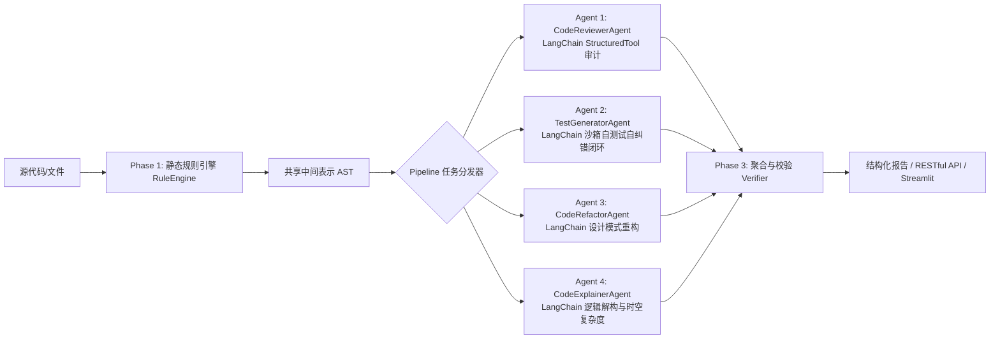

# 🤖 CodeMate-Agent 项目架构与多智能体协作指南 (AGENTS.md)

本文件适用于本工程全部模块。参考工业级企业智能系统工程架构制定，**核心底层全面采用主流 Agent 框架 LangChain (`langchain-core`, `langchain-openai`) 驱动**。

---

## 1. 服务与端口分配清单

| 服务组件 | 默认端口 | 职责定位 | 入口文件 |
| :--- | :---: | :--- | :--- |
| **Streamlit 智能体工作台** | `8501` | 多模式可视化交互控制台、工具链状态展示 | `web_app.py` |
| **FastAPI RESTful 后端** | `8000` | 两阶段流水线 API、微服务编排、Swagger 文档 | `backend/app.py` |
| **Rich 终端交互 CLI** | 控制台 | 纯命令行沉浸式交互入口 | `cli.py` |

日常联调使用 `start_all.bat` 一键启动全部服务，系统自动检测并优先采用 `E:\my_python\python.exe` 解释器；使用 `kill_all.bat` 一键清理停止端口进程。

---

## 2. 主流 Agent 框架 LangChain 驱动架构

本项目的多智能体引擎基于主流框架 **LangChain** 统一构建：

1. **统一模型推理底座 (`code_analyzer/core/llm_client.py`)**：
   - 基于 LangChain `ChatOpenAI` 封装，支持 DeepSeek-flash 标准协议与流式通信；
   - 具备 LangChain 标准参数（`temperature`, `timeout`, `max_retries`）与动态工具绑定 (`bind_tools`)。
2. **LangChain 标准工具抽象 (`codemate/tools/registry.py`)**：
   - 平台工具函数（`read_file`, `lint_code`, `execute_python_code`, `run_pytest` 等）统一导出为 LangChain 标准的 `StructuredTool`；
   - 支持向后兼容与直接注入 LangChain 管道/Agent。
3. **LangChain 消息上下文 (`code_analyzer/core/memory.py`)**：
   - 维护 LangChain 标准的 `BaseMessage` 序列（`SystemMessage`, `HumanMessage`, `AIMessage`, `ToolMessage`），实现多轮上下文窗口与工具反馈闭环。
4. **ReAct 循环引擎 (`code_analyzer/agents/base_agent.py`)**：
   - 基于 LangChain `bind_tools` + `AIMessage.tool_calls` 实现标准 ReAct (*Reasoning -> Acting -> Observation -> Reflection*) 循环。

### 专家角色定义：
1. **CodeReviewerAgent**：
   - 职责：代码漏洞排查（除零、空值、下标越界）、未处理异常、安全注入与资源泄漏（句柄未关）。
   - 交互工具：`read_file`, `lint_code`, `execute_python_code`。
2. **TestGeneratorAgent**：
   - 职责：全分支 pytest 单元测试编写，具备**测试-执行-纠错闭环 (Test-and-Fix Loop)**。
   - 交互工具：`execute_python_code`, `run_pytest`, `write_file`。
3. **CodeRefactorAgent**：
   - 职责：识别长函数、重复逻辑与高耦合，应用设计模式（如策略模式、上下文管理器、数据类封装）。
   - 交互工具：`read_file`, `lint_code`。
4. **CodeExplainerAgent**：
   - 职责：逐步逻辑拆解、核心变量状态变迁剖析与渐进式时空复杂度评估（\(O(n)\)、\(O(1)\) 等）。

---

## 3. 核心设计约束与开发边界

1. **Python 运行环境规范**：
   - 严格使用用户指定的 Python 解释器 `E:\my_python\python.exe`，严禁擅自创建任何新的虚拟环境或解释器；
   - 所有的代码执行工具（`execute_python_code`、`run_pytest`）均依托 `sys.executable`（即当前指定的解释器）安全子进程执行。
2. **模型与凭证安全**：
   - 全局默认模型优先使用 `deepseek-flash`；
   - 绝对严禁将 API Key 硬编码在代码仓库中，统一通过根目录 `.env` 加载；
   - 提交作业打包时必须自动过滤 `.env`、`.git`、缓存及虚拟环境。
3. **沙箱隔离与防死循环边界**：
   - 所有的代码执行工具（`execute_python_code`）必须运行于独立的 `subprocess` 子进程沙箱，并配置强制 `timeout`；
   - Agent 循环必须维护最大思考轮次熔断保护（`max_iterations`）。
4. **数据契约一致性**：
   - 接口输入与输出必须严格遵循 `code_analyzer/schemas/code_types.py` 与 `backend/schemas.py` 定义的 Pydantic 模型。
