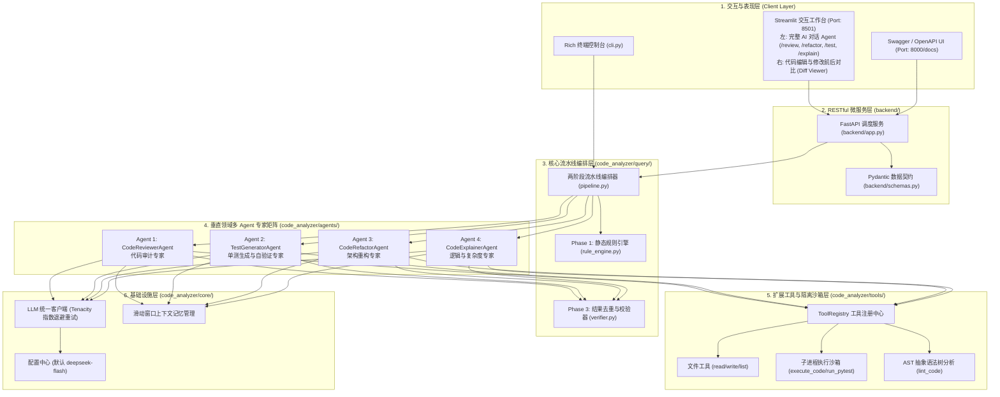

# 📐 CodeMate-Agent 系统架构与深度设计规范文档 (Desgin.md)

> **说明**：本文件为兼容作业 PPT 中文件名拼写要求之副本，完整架构内容请参见 [Design.md](file:///e:/python_project/SoftEngineeing/Design.md)。

---

## 1. 系统总体架构与分层设计 (System Architecture)

系统遵循工业级微服务与分层解耦架构，划分为表现层、服务中台层、智能体流水线编排层、专家智能体层、工具与沙箱层以及基础设施层：



---

## 2. 核心设计思想与对标创新点

### 2.1 两阶段混合分析范式 (Two-Phase Hybrid Pipeline)
- **Phase 1: 零 LLM 快速特征扫描与 AST 规则初筛 (Fast Path)**
  - 使用 Python 原生 `ast` 抽象语法树，在毫秒级内完成语法合法性校验、提取函数与类列表、定位参数过多与裸 except 异味；
- **Phase 2: 垂直领域专业 Agent 定向深度推理 (Deep Reasoning)**
  - 将 Phase 1 抽取的结构化线索作为先验知识注入对应专家 Agent，结合 ReAct 机制自主调度本地工具深度验证；
- **Phase 3: 校验、去重与严重度定级 (Verifier & Dedup)**
  - 将规则引擎发现的问题与 Agent 深度推理成果进行特征聚类与去重，按照 `CRITICAL > HIGH > MEDIUM > LOW` 严格排序输出。

### 2.2 多 Agent 专家团队架构 (Multi-Agent Team Architecture)
- **CodeReviewerAgent**：代码质量与安全审计专家
- **TestGeneratorAgent**：单元测试与自动化验证专家（测试-执行-纠错闭环）
- **CodeRefactorAgent**：架构风险隐患消除与重构专家（模式化重构）
- **CodeExplainerAgent**：逻辑解构与时空复杂度专家

---

## 3. 自动化测试报告
```bash
python -m pytest -v
```
**测试结果：32 个测试用例全部 PASSED (100% 通过率)**。
