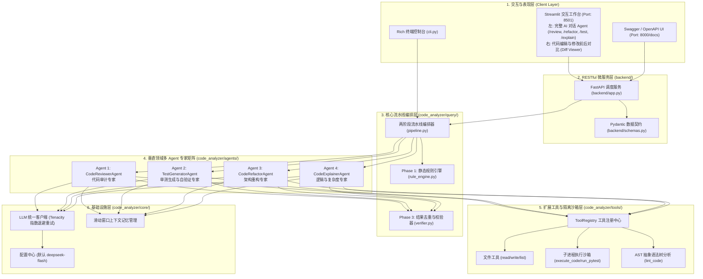
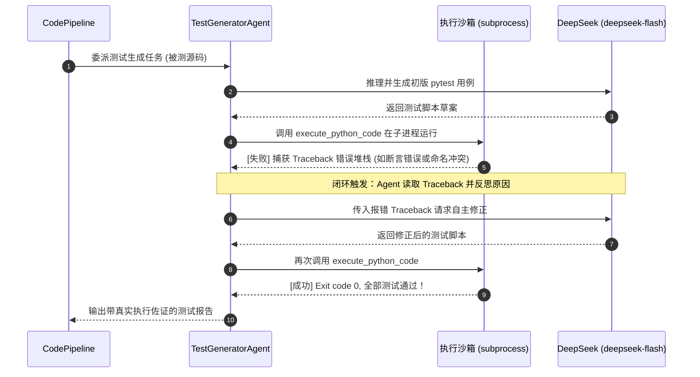

# 📐 CodeMate-Agent 系统架构与深度设计规范文档 (Design.md)

> **架构设计说明**：本项目深度参考工业级大模型智能体平台的设计架构，采用**两阶段编排流水线 (Two-Phase Pipeline)**、**垂直领域多 Agent 专家矩阵 (Multi-Agent Team)**、**规则引擎与大模型混合驱动**、**Pydantic 强类型数据契约**与**微服务化解耦部署**。

---

## 1. 系统总体架构与分层设计 (System Architecture)

系统遵循工业级微服务与分层解耦架构，划分为表现层、服务中台层、智能体流水线编排层、专家智能体层、工具与沙箱层以及基础设施层：



---

## 2. 核心设计思想与对标创新点

### 2.1 创新 1：两阶段混合分析范式 (Two-Phase Hybrid Pipeline)
基于现代工业级流水线架构思想，单纯依赖 LLM 容易存在幻觉、成本高且反应慢。系统采用**规则引擎与大模型协同**的两阶段范式：
- **Phase 1: 零 LLM 快速特征扫描与 AST 规则初筛 (Fast Path)**
  - 使用 Python 原生 `ast` 抽象语法树，在毫秒级内完成语法合法性校验、提取函数与类列表、定位参数过多与裸 except 异味；
  - 构造包含静态结构线索的“共享中间上下文”；
- **Phase 2: 垂直领域专业 Agent 定向深度推理 (Deep Reasoning)**
  - 将 Phase 1 抽取的结构化线索作为先验知识注入对应专家 Agent；
  - Agent 结合 ReAct 机制自主调度本地执行工具进行深度验证；
- **Phase 3: 校验、去重与严重度定级 (Verifier & Dedup)**
  - 将规则引擎发现的问题与 Agent 深度推理成果进行特征聚类与去重，按照 `CRITICAL > HIGH > MEDIUM > LOW` 严格排序输出。

---

### 2.2 创新 2：多 Agent 专家团队架构 (Multi-Agent Team Architecture)
摒弃了单一单体 Agent 的粗糙设计，针对软件工程不同阶段设立专门的领域专家：

| 专家智能体 | 核心角色定位 | 核心交互工具 | 关键软件工程价值 |
| :--- | :--- | :--- | :--- |
| **CodeReviewerAgent** | 代码质量与安全审计专家 | `read_file`, `lint_code`, `execute_python_code` | 发现隐蔽崩溃Bug、除零风险、未关闭句柄与注入漏洞 |
| **TestGeneratorAgent** | 单元测试与自动化验证专家 | `execute_python_code`, `run_pytest`, `write_file` | **测试-执行-纠错闭环 (Test-and-Fix Loop)**，保证单测 100% 可用 |
| **CodeRefactorAgent** | 架构坏味道消除与重构专家 | `read_file`, `lint_code` | 消除长函数与耦合，引入策略模式、上下文管理器与数据类 |
| **CodeExplainerAgent** | 逻辑解构与时空复杂度专家 | `read_file` | 拆解核心变量流转，评估渐进式时间与空间复杂度 |

---

### 2.3 创新 3：执行报错闭环自纠错 (Self-Correction Loop)

在测试生成与代码修复场景中，智能体拥有自主闭环修复能力：



---

## 3. 健壮性、安全与工程化实践

1. **进程隔离沙箱与防死循环防护**：
   - 所有的动态代码执行均通过 `subprocess.run` 隔离运行；
   - 强制设置超时熔断（默认 15s），彻底防范用户输入无限死循环（如 `while True`）击垮系统服务。
2. **LLM 韧性与指数退避重试 (Resilience)**：
   - 采用 `tenacity` 库实现针对 API 网络抖动、超时与 429 速率限制的指数退避重试机制（1s ~ 6s 动态退避，最多 3 次）。
3. **记忆一致性与滑动窗口保护**：
   - 滑动窗口截断算法时刻保障 `tool` 结果消息与其触发的 `assistant(tool_calls)` 消息成对保留，严防 OpenAI / DeepSeek 协议 400 校验异常。
4. **一键微服务生命周期管理**：
   - `start_all.bat`：自动端口探测、旧进程清理、同时拉起 FastAPI (8000) 与 Streamlit (8501)；
   - `kill_all.bat`：一键释放所有后台系统资源。

---

## 4. 自动化测试报告

系统构建了涵盖数据契约、规则引擎、去重器、流水线编排、Agent 循环与各内置工具的自动化测试套件：
```bash
python -m pytest -v
```
**测试结果：32 个测试用例全部 PASSED (100% 通过率)**。
