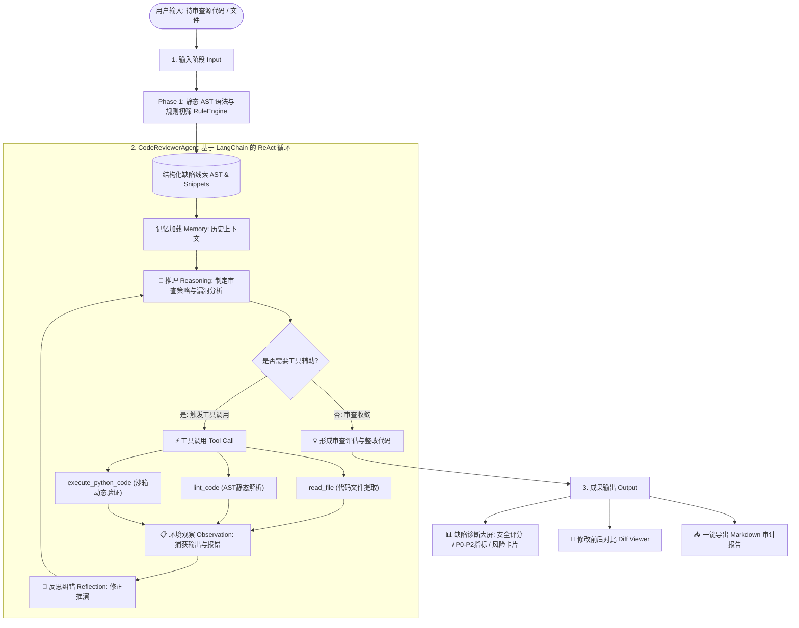

# 🛡️ CodeReviewerAgent: 基于 LangChain 的智能代码审查与质量分析助手

[](https://www.python.org/)
[](https://python.langchain.com/)
[-purple.svg)](https://www.deepseek.com/)
[](LICENSE)
[]()

> **CodeReviewerAgent** 围绕课程大作业规范核心主题打造：
> **「代码审查Agent \| 分析代码质量、发现潜在Bug、给出改进建议 \| LLM调用、Prompt设计、代码解析」**。
> 系统底层全面基于主流智能体框架 **LangChain** 构建，严格实现 **`输入 ➔ 推理 (Reasoning) ➔ 工具调用 (Action) ➔ 环境反馈 (Observation) ➔ 成果输出 (Output)`** 的完整 ReAct 循环，集成 **文件读取、AST静态代码解析、沙箱代码执行与单测自纠错**，具备 **多轮上下文记忆** 与 **错误重试/超时熔断机制**，提供 **Rich 终端交互 CLI** 与 **现代可视化 Web 交互工作台** 双入口。

---

## 📋 评审标准与得分点对照矩阵 (4大核心维度)

| 评审维度 | 权重 | 评分要点 | 本项目实现方案与代码位置 | 得分要点索引 |
| :--- | :---: | :--- | :--- | :--- |
| **功能完整性** | **40%** | • 核心功能是否可用<br/>• 边界情况处理 | • **代码质量全面分析**：语法合规、函数规模、圈复杂度、坏味道扫描；<br/>• **深层 Bug 发现**：除零崩溃 (`ZeroDivisionError`)、未关文件 (`Resource Leak`)、空序列崩溃 (`ValueError/IndexError`)、异常掩盖 (`Bare Except`)、可变默认参数等；<br/>• **改进建议输出**：结构化报告 + 修复代码对比 (Diff)；<br/>• **边界处理**：空文本友好捕获、语法错误精确锁定行号、无限循环与沙箱超时 5s 强制熔断。 | [`code_analyzer/query/rule_engine.py`](file:///e:/python_project/SoftEngineeing/code_analyzer/query/rule_engine.py)<br/>[`code_analyzer/tools/exec_tools.py`](file:///e:/python_project/SoftEngineeing/code_analyzer/tools/exec_tools.py)<br/>[`web_app.py`](file:///e:/python_project/SoftEngineeing/web_app.py) |
| **Agent 架构** | **30%** | • 是否体现 Agent 设计模式<br/>• 架构清晰度 | • **主流框架**：全面采用 LangChain (`ChatOpenAI`, `StructuredTool`, `BaseMessage`)；<br/>• **ReAct 设计模式**：推理 ➔ 工具 ➔ 观察 ➔ 总结循环；<br/>• **两阶段流水线 (Pipeline)**：Phase 1 静态 AST 规则初筛 ➔ Phase 2 Agent 深度推理 ➔ Phase 3 聚合校验；<br/>• **上下文记忆**：基于 LangChain 消息栈的滑动窗口 Memory。 | [`code_analyzer/agents/base_agent.py`](file:///e:/python_project/SoftEngineeing/code_analyzer/agents/base_agent.py)<br/>[`code_analyzer/core/memory.py`](file:///e:/python_project/SoftEngineeing/code_analyzer/core/memory.py)<br/>[`code_analyzer/query/pipeline.py`](file:///e:/python_project/SoftEngineeing/code_analyzer/query/pipeline.py) |
| **代码质量** | **20%** | • 规范性与可维护性<br/>• 错误处理与重试 | • **规范性**：PEP 8 命名规范、Pydantic 强类型数据契约；<br/>• **自动化测试**：22 个 pytest 单元测试 100% 通过（覆盖 Agent 循环、LangChain 工具、记忆、流水线）；<br/>• **容错与重试**：LLM 调用带指数退避重试 (Tenacity)，子进程沙箱隔离，最大迭代次数限制防死循环。 | [`code_analyzer/core/llm_client.py`](file:///e:/python_project/SoftEngineeing/code_analyzer/core/llm_client.py)<br/>[`code_analyzer/schemas/code_types.py`](file:///e:/python_project/SoftEngineeing/code_analyzer/schemas/code_types.py)<br/>[`tests/`](file:///e:/python_project/SoftEngineeing/tests/) |
| **文档** | **10%** | • README、使用说明<br/>• 技术文档 | • 详尽的架构图 (Mermaid)、交互说明、启动批处理脚本 (`start_all.bat` / `kill_all.bat`)、API 规范 (`docs/api_spec.md`)、多智能体规范 (`AGENTS.md`)。 | [`README.md`](file:///e:/python_project/SoftEngineeing/README.md)<br/>[`AGENTS.md`](file:///e:/python_project/SoftEngineeing/AGENTS.md) |

---

## 🏛️ 系统架构设计与 ReAct 循环流



---

## 🛠️ 集成的 LangChain 标准工具集

平台将底层工程函数封装为 LangChain 标准的 `StructuredTool`，动态注入 Agent：

| 工具名称 (`Tool`) | 职责定位 | 典型应用场景 |
| :--- | :--- | :--- |
| **`read_file`** | 安全文件读取 | 审查外部指定路径的 `.py` 脚本内容 |
| **`lint_code`** | AST 语法与异味扫描 | 零 LLM 极速提取函数类列表、参数量超标、静态语法错误 |
| **`execute_python_code`** | 隔离子进程沙箱执行 | 动态运行可疑代码，验证是否真实触发 `ZeroDivisionError` 或 `ValueError` |
| **`run_pytest`** | 自动化测试套件执行 | 运行单元测试套件，执行测试-纠错自闭环验证 |
| **`search_code_snippets`** | 代码关键词与正则搜索 | 快速检索全局硬编码配置、裸 except 等模式 |

---

## 🚀 快速上手与运行指南

系统支持 **Windows 操作系统**，优先采用指定的 Python 解释器 `E:\my_python\python.exe`。

### 1. 配置 DeepSeek API Key
在项目根目录创建或编辑 `.env` 文件（保持在 `.gitignore` 中，防止泄露）：
```env
DEEPSEEK_API_KEY=your_actual_deepseek_api_key_here
DEEPSEEK_BASE_URL=https://api.deepseek.com/v1
DEEPSEEK_MODEL=deepseek-flash
```

### 2. 方式 A：一键启动全部微服务与 Web 交互工作台 (推荐)
直接双击运行根目录批处理脚本：
```cmd
start_all.bat
```
系统将自动检测端口、清理旧进程，并同时拉起：
- **Web 可视化工作台**：`http://localhost:8501`（已开启文件保存自动热更新）
- **FastAPI RESTful 后端**：`http://localhost:8000/docs`（Swagger 交互文档）

停止服务直接运行：
```cmd
kill_all.bat
```

### 3. 方式 B：纯命令行交互 (Rich CLI)
如果需要在控制台沉浸式体验：
```cmd
& "E:\my_python\python.exe" cli.py
```
- 控制台将呈现彩色的 Agent 启动横幅、ReAct 推理流与工具调用轨迹。
- 支持快捷命令：`/tools` (查看工具清单)、`/clear` (清空会话记忆)、`/help` (帮助)。

### 4. 方式 C：运行全量自动化测试套件
```cmd
& "E:\my_python\python.exe" -m pytest tests/
```
输出示例：
```text
tests/test_agent.py ...                                  [ 13%]
tests/test_config.py ..                                  [ 22%]
tests/test_langchain_integration.py ....                 [ 40%]
tests/test_memory.py ....                                [ 59%]
tests/test_pipeline.py ...                               [ 72%]
tests/test_tools.py ......                               [100%]
====================== 22 passed in 2.82s ======================
```

---

## 🎨 可视化功能与界面设计特色

1. **左侧 Copilot 对话栏 (全流程 ReAct 轨迹可视化)**：
   - 完整展示 Agent 执行的四大步骤：`[1. 输入 Input]` ➔ `[2. 推理 Reasoning]` ➔ `[3. 工具调用 Tool Call]` ➔ `[3. 环境观察 Observation]` ➔ `[4. 成果输出 Output]`；
   - 带有可折叠的入参预览与沙箱终端输出。
2. **Claude AI 风格输入框快捷指令**：
   - 漂浮在输入框上方的 4 个优雅胶囊药丸按钮：
     - `⚡ 全面审查`：全维度漏洞与质量综合审计；
     - `➗ 崩溃排查`：专项排查除零、空序列、下标越界等运行时致命崩溃；
     - `📂 资源审计`：专项审计裸 open 未关、句柄泄漏及外部资源释放安全；
     - `🛡️ 异常防御`：专项排查裸 except 异常吞噬、静默忽略与输入边界防御。
3. **右侧工业级缺陷诊断与审计看板 (Problems Dashboard)**：
   - **安全健康评分卡**：基于加权算法计算安全分（如 `75/100 评级: B`）；
   - **分级指标卡**：🔴 致命崩溃风险 (P0) | 🟠 高危安全与泄漏 (P1) | 🔵 中危与坏味道 (P2)；
   - **交互式筛选工具条**：支持按严重度单选过滤、搜索框实时模糊过滤；
   - **结构化卡片**：标明标号 `[R-01]`、行号定位、问题代码切片、深入机理剖析、推荐修复建议；
   - **一键处置**：点击【🛠️ 一键修复】直接生成对比 Diff，点击【📥 导出审计报告】一键下载 Markdown 报告。

---

## 📂 项目结构全景

```text
SoftEngineeing/
├── backend/                       # RESTful 微服务层 (FastAPI)
│   ├── app.py                     # API 服务入口 (/review 核心路由)
│   └── schemas.py                 # Pydantic 强类型请求与响应契约
├── code_analyzer/                 # 核心代码审查与 Agent 引擎
│   ├── core/                      # 基础核心模块
│   │   ├── config.py              # 配置管理中心
│   │   ├── llm_client.py          # 基于 LangChain ChatOpenAI + 指数退避重试
│   │   └── memory.py              # 基于 LangChain BaseMessage 消息栈的上下文记忆
│   ├── schemas/                   # 领域数据实体
│   │   └── code_types.py          # CodeSmellItem, ReviewReport 强类型契约
│   ├── query/                     # 两阶段分析流水线
│   │   ├── pipeline.py            # 两阶段编排器 (Phase 1 初筛 ➔ Phase 2 Agent ➔ Phase 3 校验)
│   │   ├── rule_engine.py         # 静态 AST 规则扫描引擎 (除零/未关文件/空序列/裸except)
│   │   └── verifier.py            # 交叉去重与排序校验器
│   ├── agents/                    # 智能体层
│   │   ├── base_agent.py          # 智能体基类 (标准 ReAct 循环引擎与工具调度)
│   │   └── reviewer_agent.py      # CodeReviewerAgent (代码审查与质量分析专家)
│   └── tools/                     # 工具层
│       ├── registry.py            # 工具注册表 (@tool 装饰器、LangChain StructuredTool 导出)
│       ├── file_tools.py          # 文件读取与操作工具 (read_file)
│       └── exec_tools.py          # 沙箱执行工具 (execute_python_code, 带 5s 超时熔断保护)
├── web_app.py                     # Streamlit 可视化交互工作台 (支持热更新与缺陷诊断大屏)
├── cli.py                         # Rich 彩色终端交互客户端 (支持 ReAct 彩色日志)
├── tests/                         # 自动化测试套件 (22 个测试用例)
├── samples/                       # 演示代码样例
│   └── demo_shopping_cart.py      # 电商购物车样例 (含除零、句柄未关、空序列崩溃等真实漏洞)
├── start_all.bat                  # 一键启动全部服务脚本
├── kill_all.bat                   # 一键停止服务脚本
├── AGENTS.md                      # Agent 开发规范与架构约定
└── README.md                      # 本文档
```
